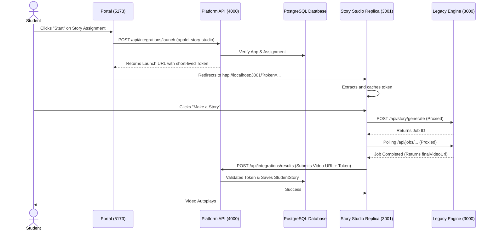

# EduVision Architecture

## System Components

EduVision is organized into a modular, service-oriented architecture:

### 1. Platform Portal (`platform/portal` - Port 5173)
A modern single-page application built with React and Vite. It serves as the unified interface for all users:
- **Teachers/Admins**: Access dashboards to manage classes, create assignments, and view aggregated student activity results.
- **Students**: Access a child-friendly, passwordless portal (selecting their class, then their avatar) to view pending assignments and seamlessly launch educational apps securely.

### 2. Platform API (`platform/api` - Port 4000)
The central backend service built with Node.js and Express. It manages the persistent data model and orchestrates the integration of educational apps:
- **Authentication/RBAC**: Issues JWT tokens (`/api/auth`) and enforces strict role-based access control (`TEACHER`, `STUDENT`, `ADMIN`).
- **PostgreSQL Database**: Uses Prisma ORM to manage Users, Roles, Classes, Assignments, Applications, and Activity Results.
- **Application Integration Contract**: Exposes `/api/integrations/launch` to securely mint short-lived assignment tokens, and `/api/integrations/results` to persistently store app results.
- **Student History Registry**: Securely stores and serves historical activity and generated stories scoped to the logged-in student.
- **Logging & Tracing**: Implements `winston` structured logging and `cls-rtracer` to inject and track `X-Correlation-Id` across all requests.

### 3. Student Story Studio Replica (`platform/student-story-studio` - Port 3001)
A student-facing implementation of the Story Studio:
- Acts as a frontend wrapper that fits inside the EduVision Application Integration Contract.
- Integrates the legacy Python Engine by acting as a reverse proxy to Port 3000.
- Submits generated video URLs back to the Platform API so they persist against the specific student's ID.

### 4. Legacy Story Engine (`eduvision_ui` - Port 3000)
The original, unmodified Python-backed engine:
- Exposes raw `/api/story/generate` endpoints.
- Processes `.bvh` motion files and character images using Python scripts and `TorchServe`.
- Isolated from platform authentication rules (it is treated as a dumb worker).

## End-to-End Story Generation Sequence

## Application Integration Contract
EduVision allows seamless integration of third-party educational apps (like `math-blaster-sample`).
1. **Registry**: The app is registered in the PostgreSQL `Application` table with a `launchUrl`.
2. **Context Passing**: When a student clicks "Launch", the platform generates a signed JWT containing the `studentId`, `assignmentId`, and `appId`. This token is appended to the `launchUrl`.
3. **Data Return**: When the child finishes the activity, the app sends a `POST` request to the platform's `/api/integrations/results` endpoint containing the token and the result data. The platform inherently trusts the data context because the token is signed and verified.
