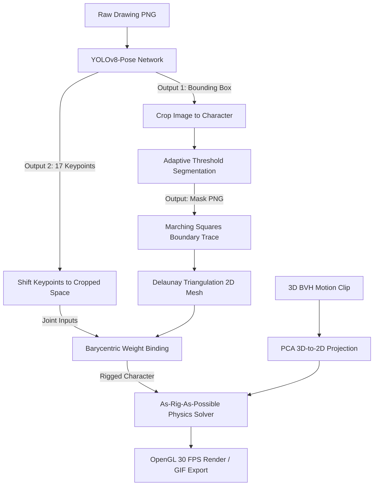

# Computer Vision & Graphics Rendering: An MVP Rigging Textbook

### Work Log
* **Total Time Invested:** ~17 Hours (Initial setup, dataset extraction, coordinate alignment fix, Colab training integration, spatial padding augmentation, and massive dataset scaling)
* **Last Log Date:** July 25, 2026

This textbook compiles the mathematical, theoretical, and practical aspects of building a real-time character animation pipeline for children's hand-drawn sketches.

This document serves as the **Table of Contents** and covers the high-level system architecture.

---

## Table of Contents

### [Chapter 1: Deep Learning Pose Estimation (YOLOv8-Pose)](chapter1_yolo_pose.md)
* Learn how convolutional networks detect objects and regresses joint keypoints in a single pass.
* Covers: CSPDarknet backbones, PANet necks, anchor-free regression heads, and loss functions (CIoU, DFL, OKS).

### [Chapter 2: The Dataset & Coordinate System Alignment](chapter2_data_coordinates.md)
* Learn the coordinate math required to map dataset labels to downscaled and cropped images.
* Covers: Pixel coordinate space, original vs. cropped dimensions, and scale matching equations.

### [Chapter 3: Deep Learning Training & Performance Mechanics](chapter3_training_mechanics.md)
* Learn how cloud GPUs train neural networks and how to evaluate training performance.
* Covers: Transfer learning (fine-tuning), T4 GPU processing, dataset splits, learning rates, and training metrics (Loss, Precision, Recall, mAP50).

### [Chapter 4: 2D Graphics Geometry & Physics Deformations](chapter4_graphics_rendering.md)
* Learn how a static 2D drawing is converted into a moving 2D triangle mesh controlled by a skeleton.
* Covers: Marching Squares contouring, Delaunay Triangulation mesh creation, Barycentric coordinates (rigging), PCA projections, and As-Rig-As-Possible (ARAP) physics solvers.

### [Chapter 5: Google Colab Training Workflow](chapter5_colab_workflow.md)
* Learn the step-by-step cloud workflow for training custom YOLO models.
* Covers: GPU provisioning, ZIP uploading, terminal decompression, Ultralytics setup, and training logs.

### [Chapter 6: Massive Cloud Scaling & Spatial Padding](chapter6_cloud_scaling.md)
* Learn how to resolve neural network mode collapse using spatial padding augmentation and cloud data streaming.
* Covers: Overfitting diagnosis, canvas embedding coordinate math, Meta CDN streaming, and persistent Google Drive model checkpointing.

---

## Pipeline Architecture

The end-to-end pipeline of the animation engine consists of the following data flow:

